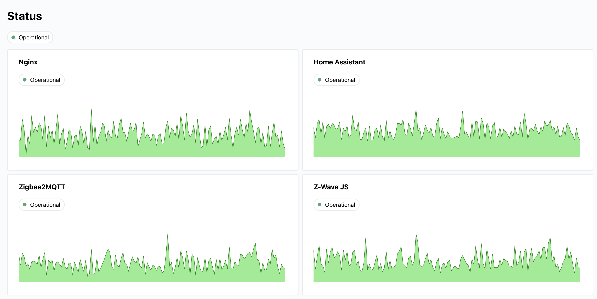

# monitor

[](https://github.com/bendiksolheim/monitor/actions/workflows/build-and-publish.yml) [](https://hub.docker.com/r/bendiksolheim/monitor)




Monitor services in your home lab for free, without all that enterprise hassle. Define services you want to monitor, and Monitor queries them over HTTP according to a specified interval. Report to one of more of the [supported external services](#) when something is wrong.

## Configuration

```json
{
  "services": [
    {
      "service": "vg.no",
      "schedule": "every 1 minute",
      "url": "https://www.vg.no",
      "okStatusCode": 200
    },
    {
      "service": "nas",
      "schedule": "every 1 minute",
      "url": "http://192.168.1.200:5000",
      "okStatusCode": 200
    },
    {
      "service": "Home Assistant",
      "schedule": "every 10 minutes",
      "url": "http://192.168.1.89:4357",
      "okStatusCode": 200
    },
    {
      "service": "Nginx",
      "schedule": "every 1 minute",
      "url": "http://macbook-server:80",
      "okStatusCode": 301
    }
  ],
  "healthcheck": {
    "url": "https://hc-ping.com/1234567890",
    "schedule": "every 10 minutes"
  }
}
```

The `healthcheck` property is optional. Skipping it will make this tool function just as a uptime checker.

## Run

Runs as a docker container. Assuming you have saved your config in `./config/config.json`, run this command:

```sh
docker run -v ./config:/config -p 3000:3000 bendiksolheim/monitor:latest
```

See [docker-compose.yml](./docker-compose.yml) for a docker compose example.

## Prerequisites

- Node.js 20+
- pnpm 9+ (install via `corepack enable` or see [pnpm installation](https://pnpm.io/installation))

## Development

1. Enable corepack (if not already enabled):
   ```bash
   corepack enable
   ```

2. Install dependencies:
   ```bash
   pnpm install
   ```

3. Create an example configuration:
   ```bash
   pnpm run create-config
   ```

4. Generate some test data:
   ```bash
   pnpm run generate-test-data
   ```

5. Run development server:
   ```bash
   pnpm dev
   ```
