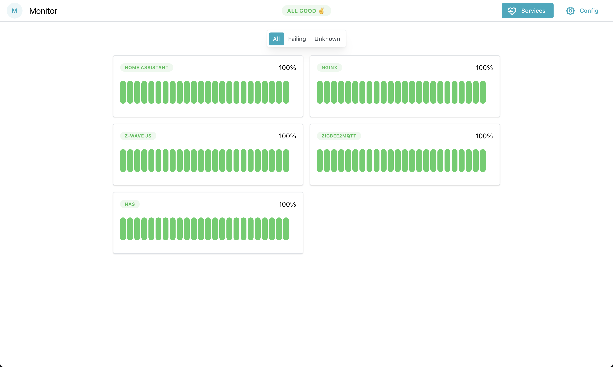

# monitor

[](https://github.com/bendiksolheim/monitor/actions/workflows/build-and-publish.yml)



Monitor services in your home lab for free, without all the enterprise hassle. Define the services you want to monitor, and Monitor queries them by HTTP according to the specified interval. Optionally report to [Healthchecks.io](https://healthchecks.io) to get notified by email when something is wrong.

## Configuration

```json
{
  "services": [
    {
      "service": "vg.no",
      "schedule": "every 1 minute",
      "url": "https://www.vg.no",
      "okStatusCode": 200
    },
    {
      "service": "nas",
      "schedule": "every 1 minute",
      "url": "http://192.168.1.200:5000",
      "okStatusCode": 200
    },
    {
      "service": "Home Assistant",
      "schedule": "every 10 minutes",
      "url": "http://192.168.1.89:4357",
      "okStatusCode": 200
    },
    {
      "service": "Nginx",
      "schedule": "every 1 minute",
      "url": "http://macbook-server:80",
      "okStatusCode": 301
    }
  ],
  "healthcheck": {
    "url": "https://hc-ping.com/1234567890",
    "schedule": "every 10 minutes"
  }
}
```

The `healthcheck` property is optional. Skipping it will make this tool function just as a uptime checker.

## Run

Runs as a docker container. Assuming you have saved your config in `./config/config.json`, run this command:

```sh
docker run -v ./config:/config -p 3000:3000 bendiksolheim/monitor:latest
```

See [docker-compose.yml](./docker-compose.yml) for a docker compose example.

## Development

```bash
# Create an example configuration
npm run create-config

# Generate some test data
npm run generate-test-data

# Run server
npm run dev
```
